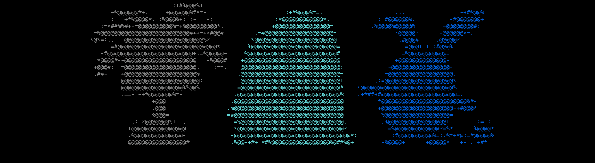
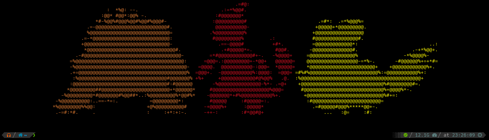
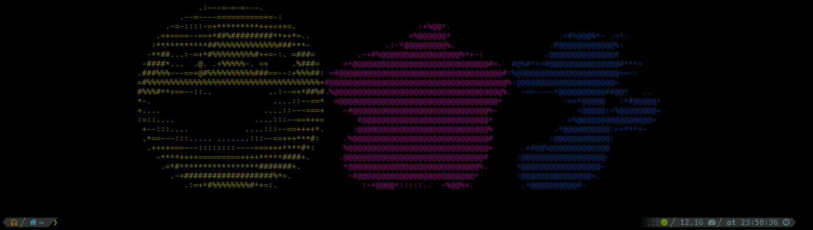
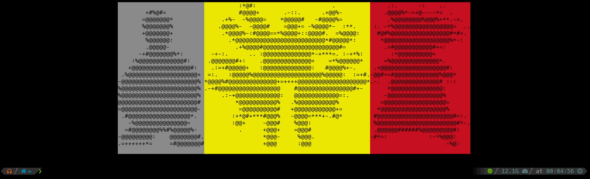

<div id="top"></div>
<!--
*** Thanks for checking out the Best-README-Template. If you have a suggestion
*** that would make this better, please fork the repo and create a pull request
*** or simply open an issue with the tag "enhancement".
*** Don't forget to give the project a star!
*** Thanks again! Now go create something AMAZING! :D
-->


<!-- PROJECT SHIELDS -->
<!--
*** I'm using markdown "reference style" links for readability.
*** Reference links are enclosed in brackets [ ] instead of parentheses ( ).
*** See the bottom of this document for the declaration of the reference variables
*** for contributors-url, forks-url, etc. This is an optional, concise syntax you may use.
*** https://www.markdownguide.org/basic-syntax/#reference-style-links
-->
[![Contributors][contributors-shield]][contributors-url]
[![Forks][forks-shield]][forks-url]
[![Stargazers][stars-shield]][stars-url]
[![Issues][issues-shield]][issues-url]
[![MIT License][license-shield]][license-url]
[![LinkedIn][linkedin-shield]][linkedin-url]


<!-- PROJECT LOGO -->
<br />
<div align="center">
<a href="https://github.com/p4nchit0z/PokeASCIILogin">
   </a>

<h3 align="center">PokeASCIILogin</h3>

  <p align="center">
    A simple, useless but also pretty script written in Go that prints random Pokemon across your terminal every time you login (or every time you want!)
       </a>
    <br />
    <a href="https://github.com/p4nchit0z/PokeASCIILogin"><strong>Explore the docs »</strong></a>
    <br />
    <br />
    <a href="https://github.com/p4nchit0z/PokeASCIILogin">View Demo</a>
    ·
    <a href="https://github.com/p4nchit0z/PokeASCIILogin/issues">Report Bug</a>
    ·
    <a href="https://github.com/p4nchit0z/PokeASCIILogin/issues">Request Feature</a>
  </p>
</div>


<!-- TABLE OF CONTENTS -->
<details>
  <summary>Table of Contents</summary>
  <ol>
    <li>
      <a href="#about-the-project">About The Project</a>     
    </li>
    <li>
      <a href="#prerequisites">Prerequisites</a>     
      <li><a href="#installation">Installation</a></li>
    </li>
    <li><a href="#usage">Usage</a></li>
    <li><a href="#coming-soon">Coming Soon...</a></li>
    <li><a href="#license">License</a></li>
    <li><a href="#contact">Contact</a></li>
    <li><a href="#acknowledgments">Acknowledgments</a>
    <ul>
        <li><a href="#built-with">Built With</a></li>
      </ul>
    </li>
  </ol>
</details>


<!-- ABOUT THE PROJECT -->
## About The Project

                                        ,'\
          _.----.        ____         ,'  _\   ___    ___     ____
      _,-'       `.     |    |  /`.   \,-'    |   \  /   |   |    \  |`.
      \      __    \    '-.  | /   `.  ___    |    \/    |   '-.   \ |  |
       \.    \ \   |  __  |  |/    ,','_  `.  |          | __  |    \|  |
         \    \/   /,' _`.|      ,' / / / /   |          ,' _`.|     |  |
          \     ,-'/  /   \    ,'   | \/ / ,`.|         /  /   \  |     |
           \    \ |   \_/  |   `-.  \    `'  /|  |    ||   \_/  | |\    |
            \    \ \      /       `-.`.___,-' |  |\  /| \      /  | |   |
             \    \ `.__,'|  |`-._    `|      |__| \/ |  `.__,'|  | |   |
              \_.-'       |__|    `-._ |              '-.|     '-.| |   |
                                      `'                            '-._|
                                    ASCII LOGIN

**Do you love Pokemon and you also use terminal a lot as I do?** Well, I thought a simple pretty message every time you log in (or every time you want) with some random Pokemon on it would be nice. And that is exactly what I did! 

Nice, useless and simple!

There was a time where I used [Pokemon Terminal](https://github.com/LazoCoder/Pokemon-Terminal) (a great project, by the way, check it out!). However, changing the background of my terminal was a little bit too much for me, since the background color of some Pokemon that I liked just did not fit with the colors of my font I was used to use. So I decided to write a simpler idea, based on that project, but less 'intrusive'. The solution? A simple, but pretty message.


<p align="right">(<a href="#top">back to top</a>)</p>


<!-- GETTING STARTED -->

## Prerequisites

Since it is written in Go, here I provide an executable binary. So you do not need to install Go or any other dependencies on your machine. Enjoy!

*Alternative*: You just need Go on your machine and build the project with `go build` command.
<p align="right">(<a href="#top">back to top</a>)</p>

---

## Installation

See [Installation guide](installation.md) to check how to install it on your machine!


<p align="right">(<a href="#top">back to top</a>)</p>


<!-- USAGE EXAMPLES -->
## Usage

Since it is a simple executable you just can type in your terminal:

```
abs/path/to/PokeASCIILogin
```

will show you something like



However, since I tried to create it as a 'login', I recommend to add this executable to your "resource file" `.rc` for more fun!

If the program is capable of reading the number of columns in your terminal, Pokemon printed will be centered. Otherwise they will just be printed at left side (just as a normal print).

<p align="right">(<a href="#top">back to top</a>)</p>

---

### Configuration / Customization

In your `PokeASCIILogin` directory you have just cloned, you will find another directory called `data` and within it a JSON file called `config.json`. Changing values in `data/config.json` file will configure Pokemon that will be printed. You can set the following parameters to 'customize' Pokemon printed as follows:

- `gen`: Value can be set from `0` to `8`. This is the number of the gen of Pokemon you want to print. For example, setting this value to `"gen": 1` will only print Pokemon from 1st gen. Default value is `0`, where `0` basically means "any gen".
- `color`: Color for every Pokemon to be printed. Default value is `default`, which means every Pokemon will be printed with a color related with its primary type as provided by [PokeApi](https://pokeapi.co/). Others values accepted are `random` which will select a completely random color for every Pokemon or you just can type a color, e.g., `"color": "red"` will print all Pokemon in red color.
- `style`: This one is my favorite. Typical terminals have 2 styles allowed: `blink` and `reverse`. Changing style to one of these options will look like the following: 
 
  - `blink`
  
  - `reverse`
  

  Default `style` is `none`.

- `group`: I decided to group Pokemon is some groups, which are `starter`, `legendary`, `pseudolegendary`, `favorite` and `none`. Where `none` are simply Pokemon that do not belong to the first 4 groups mentioned. 

   P.S.: If you really love some Pokemon and you always want it on your screen, a 'hack' tip is editing `data/config.json` file to the Pokemon you wish, and change its group to `favorite`.
<p align="right">(<a href="#top">back to top</a>)</p>

---

<!-- ROADMAP -->
## Coming Soon...

Depending on the support this simple thing has, I will try to add the following features

- [ ] Be able to select completely custom Pokemon just by their name or ID
- [ ] Order Pokemon by different criterias such as ID, weight, height, etc


See the [open issues](https://github.com/p4nchit0z/PokeASCIILogin/issues) for a full list of proposed features (and known issues).

<p align="right">(<a href="#top">back to top</a>)</p>


---

<!-- LICENSE -->
## License

Distributed under the GNU General Public License v3.0. See [LICENSE](license-url) for more information.

<p align="right">(<a href="#top">back to top</a>)</p>

---

<!-- CONTACT -->
## Contact

p4nchit0z - ffcarrasco@uc.cl

Project Link: [https://github.com/p4nchit0z/PokeASCIILogin](https://github.com/p4nchit0z/PokeASCIILogin)

<p align="right">(<a href="#top">back to top</a>)</p>

---

<!-- ACKNOWLEDGMENTS -->
## Acknowledgments

* [PokeApi - The RESTful Pokémon API](https://pokeapi.co/)
* [pokeapi-go - Wrapper for PokeApi in Go](https://github.com/mtslzr/pokeapi-go)

### Built With

* [The Go Programming language](https://go.dev/)

---

<p align="right">(<a href="#top">back to top</a>)</p>


<!-- MARKDOWN LINKS & IMAGES -->
<!-- https://www.markdownguide.org/basic-syntax/#reference-style-links -->
[contributors-shield]: https://img.shields.io/github/contributors/p4nchit0z/PokeASCIILogin.svg?style=for-the-badge
[contributors-url]: https://github.com/p4nchit0z/PokeASCIILogin/graphs/contributors
[forks-shield]: https://img.shields.io/github/forks/p4nchit0z/PokeASCIILogin.svg?style=for-the-badge
[forks-url]: https://github.com/p4nchit0z/PokeASCIILogin/network/members
[stars-shield]: https://img.shields.io/github/stars/p4nchit0z/PokeASCIILogin.svg?style=for-the-badge
[stars-url]: https://github.com/p4nchit0z/PokeASCIILogin/stargazers
[issues-shield]: https://img.shields.io/github/issues/p4nchit0z/PokeASCIILogin.svg?style=for-the-badge
[issues-url]: https://github.com/p4nchit0z/PokeASCIILogin/issues
[license-shield]: https://img.shields.io/github/license/p4nchit0z/PokeASCIILogin.svg?style=for-the-badge
[license-url]: https://github.com/p4nchit0z/PokeASCIILogin/blob/main/LICENSE.txt
[linkedin-shield]: https://img.shields.io/badge/-LinkedIn-black.svg?style=for-the-badge&logo=linkedin&colorB=555
[linkedin-url]: https://linkedin.com/in/francisco-carrasco-varela-cl
[product-screenshot]: images/screenshot.png
