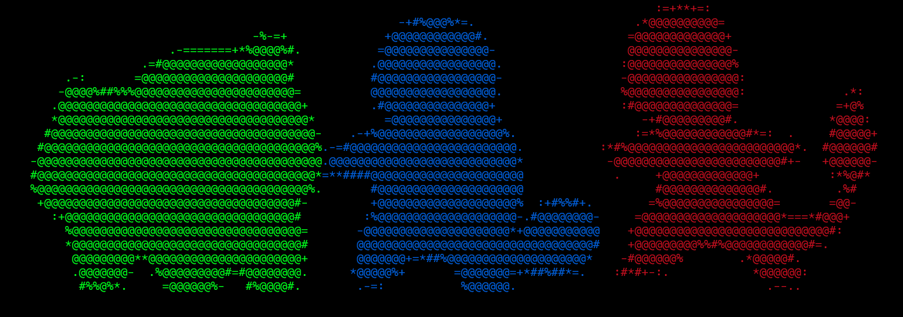

<div id="top"></div>
<!--
*** Thanks for checking out the Best-README-Template. If you have a suggestion
*** that would make this better, please fork the repo and create a pull request
*** or simply open an issue with the tag "enhancement".
*** Don't forget to give the project a star!
*** Thanks again! Now go create something AMAZING! :D
-->


<!-- PROJECT SHIELDS -->
<!--
*** I'm using markdown "reference style" links for readability.
*** Reference links are enclosed in brackets [ ] instead of parentheses ( ).
*** See the bottom of this document for the declaration of the reference variables
*** for contributors-url, forks-url, etc. This is an optional, concise syntax you may use.
*** https://www.markdownguide.org/basic-syntax/#reference-style-links
-->
[![Contributors][contributors-shield]][contributors-url]
[![Forks][forks-shield]][forks-url]
[![Stargazers][stars-shield]][stars-url]
[![Issues][issues-shield]][issues-url]
[![MIT License][license-shield]][license-url]
[![LinkedIn][linkedin-shield]][linkedin-url]


<!-- PROJECT LOGO -->
<br />
<div align="center">
<a href="https://github.com/p4nchit0z/PokeASCIILogin">
   </a>


<h3 align="center">PokeASCIILogin</h3>

  <p align="center">
    A simple, useless but also pretty script written in Go that prints random Pokemons across your terminal every time you login (or every time you want!)
    <br />
    <a href="https://github.com/p4nchit0z/PokeASCIILogin"><strong>Explore the docs »</strong></a>
    <br />
    <br />
    <a href="https://github.com/p4nchit0z/PokeASCIILogin">View Demo</a>
    ·
    <a href="https://github.com/p4nchit0z/PokeASCIILogin/issues">Report Bug</a>
    ·
    <a href="https://github.com/p4nchit0z/PokeASCIILogin/issues">Request Feature</a>
  </p>
</div>


<!-- TABLE OF CONTENTS -->
<details>
  <summary>Table of Contents</summary>
  <ol>
    <li>
      <a href="#about-the-project">About The Project</a>
      <ul>
        <li><a href="#built-with">Built With</a></li>
      </ul>
    </li>
    <li>
      <a href="#installation">Getting Started</a>
      <ul>
        <li><a href="#prerequisites">Prerequisites</a></li>
        <li><a href="#installing">Installation</a></li>
      </ul>
    </li>
    <li><a href="#usage">Usage</a></li>
    <li><a href="#roadmap">Roadmap</a></li>
    <li><a href="#contributing">Contributing</a></li>
    <li><a href="#license">License</a></li>
    <li><a href="#contact">Contact</a></li>
    <li><a href="#acknowledgments">Acknowledgments</a></li>
  </ol>
</details>


<!-- ABOUT THE PROJECT -->
## About The Project

                                        ,'\
          _.----.        ____         ,'  _\   ___    ___     ____
      _,-'       `.     |    |  /`.   \,-'    |   \  /   |   |    \  |`.
      \      __    \    '-.  | /   `.  ___    |    \/    |   '-.   \ |  |
       \.    \ \   |  __  |  |/    ,','_  `.  |          | __  |    \|  |
         \    \/   /,' _`.|      ,' / / / /   |          ,' _`.|     |  |
          \     ,-'/  /   \    ,'   | \/ / ,`.|         /  /   \  |     |
           \    \ |   \_/  |   `-.  \    `'  /|  |    ||   \_/  | |\    |
            \    \ \      /       `-.`.___,-' |  |\  /| \      /  | |   |
             \    \ `.__,'|  |`-._    `|      |__| \/ |  `.__,'|  | |   |
              \_.-'       |__|    `-._ |              '-.|     '-.| |   |
                                      `'                            '-._|
                                    ASCII LOGIN

**Do you love Pokemon and you also use terminal a lot as I do?** Well, I thought a simple pretty message every time you log in (or every time you want) with some random Pokemon on it would be nice. And that is exactly what I did! 

Nice, useless and simple!

There was a time where I used [Pokemon Terminal](https://github.com/LazoCoder/Pokemon-Terminal) (a great project, by the way, check it out!). However, changing the background of my terminal was a little bit too much for me, since the background color of some Pokemon that I liked just did not fit with the colors of my font I was used to use. So I decided to write a simpler idea, based on that project, but less 'intrusive'. The solution? A simple, but pretty message.


<p align="right">(<a href="#top">back to top</a>)</p>


### Built With

* [The Go Programming language](https://go.dev/)

<p align="right">(<a href="#top">back to top</a>)</p>

---

<!-- GETTING STARTED -->

## Prerequisites

Since it is written in Go, here I provide an executable binary. So you do not need to install Go on your machine. 

*Alternative*: You just need Go on your machine

---

## Installation
I provide 2 different ways to install this script:
#### I. Install with a simple Bash script
1. Download `install.sh` script from the repo using `wget` or `curl` (we use `wget` in this example)
```
wget https://raw.githubusercontent.com/p4nchit0z/PokeASCIILogin/main/install.sh -O install.sh
```

2. Execute the script
   ```sh
   bash install.sh
   ```
   P.S.: you might need to provide permissions with `chmod +x install.sh` command

   This will do the following:
   - Clone the repo (create a folder and download all needed files within it)
   - Check if files have been downloaded properly
   - Add the executable to your `.rc` file if you are using Bash or Zsh shell. If you use a different shell you will have to add the executable manually  to your equivalent of `.rc` file (`.bashrc` in Bash, `.zshrc` in Zsh) of your shell (see step 2 in 'Manual Installation')

3.  (Optional) You might need to give some permissions to the executable with:
   ```
   chmod +x ./abs/path/to/PokeASCII/executable
   ```
#### II. Manual way
1. Clone the repo
```
git clone github.com/p4nchit0z/PokeASCIILogin
```

2. Add the cloned executable to your .rc file (`.bashrc` for Bash shell, `.zshrc` for ZSH shell and so on...)

```
echo "/abs/path/to/PokeASCII/executable" >> $HOME/"YOUR_RC_FILE_HERE"
```
for example, if your user is `MyUsername` and you use `ZSH` shell:
```
echo "/home/MyUsername/PokeASCIILogin/PokeASCIILogin" >> $HOME/.zshrc
```
where `"/home/MyUsername/PokeASCIILogin/PokeASCIILogin"` is the absolute path to PokeASCIILogin executable.

3. (Optional) You might need to give some permissions to the executable with:
   ```
   chmod +x ./abs/path/to/PokeASCII/executable
   ```

4. Restart your terminal, or run:
```
source YOUR_RC_FILE_HERE
```
where in my example this is:
```
source $HOME/.zshrc
```

<p align="right">(<a href="#top">back to top</a>)</p>


<!-- USAGE EXAMPLES -->
## Usage

Use this space to show useful examples of how a project can be used. Additional screenshots, code examples and demos work well in this space. You may also link to more resources.

_For more examples, please refer to the [Documentation](https://example.com)_

<p align="right">(<a href="#top">back to top</a>)</p>


<!-- ROADMAP -->
## Roadmap

- [ ] Feature 1
- [ ] Feature 2
- [ ] Feature 3
    - [ ] Nested Feature

See the [open issues](https://github.com/p4nchit0z/PokeASCIILogin/issues) for a full list of proposed features (and known issues).

<p align="right">(<a href="#top">back to top</a>)</p>


<!-- LICENSE -->
## License

Distributed under the GNU General Public License v3.0. See [LICENSE](license) for more information.

<p align="right">(<a href="#top">back to top</a>)</p>


<!-- CONTACT -->
## Contact

p4nchit0z - ffcarrasco@uc.cl

Project Link: [https://github.com/p4nchit0z/PokeASCIILogin](https://github.com/p4nchit0z/PokeASCIILogin)

<p align="right">(<a href="#top">back to top</a>)</p>


<!-- ACKNOWLEDGMENTS -->
## Acknowledgments

* [PokeApi - The RESTful Pokémon API](https://pokeapi.co/)
* [pokeapi-go - Wrapper for PokeApi in Go](https://github.com/mtslzr/pokeapi-go)

<p align="right">(<a href="#top">back to top</a>)</p>


<!-- MARKDOWN LINKS & IMAGES -->
<!-- https://www.markdownguide.org/basic-syntax/#reference-style-links -->
[contributors-shield]: https://img.shields.io/github/contributors/p4nchit0z/PokeASCIILogin.svg?style=for-the-badge
[contributors-url]: https://github.com/p4nchit0z/PokeASCIILogin/graphs/contributors
[forks-shield]: https://img.shields.io/github/forks/p4nchit0z/PokeASCIILogin.svg?style=for-the-badge
[forks-url]: https://github.com/p4nchit0z/PokeASCIILogin/network/members
[stars-shield]: https://img.shields.io/github/stars/p4nchit0z/PokeASCIILogin.svg?style=for-the-badge
[stars-url]: https://github.com/p4nchit0z/PokeASCIILogin/stargazers
[issues-shield]: https://img.shields.io/github/issues/p4nchit0z/PokeASCIILogin.svg?style=for-the-badge
[issues-url]: https://github.com/p4nchit0z/PokeASCIILogin/issues
[license-shield]: https://img.shields.io/github/license/p4nchit0z/PokeASCIILogin.svg?style=for-the-badge
[license-url]: https://github.com/p4nchit0z/PokeASCIILogin/blob/master/LICENSE.txt
[linkedin-shield]: https://img.shields.io/badge/-LinkedIn-black.svg?style=for-the-badge&logo=linkedin&colorB=555
[linkedin-url]: https://linkedin.com/in/francisco-carrasco-varela-cl
[product-screenshot]: images/screenshot.png
